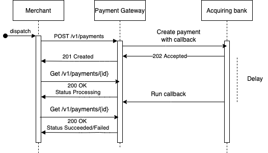

# Payment Gateway


E-Commerce is experiencing exponential growth and merchants who sell their goods or services online need a way to easily collect money from their customers.
Payment Gateway is an API based application that will allow a merchant to offer a way for their shoppers to pay for their product.

## Deliverables

1. Build an API that allows a merchant:
   * To process a payment through your payment gateway.
   * To retrieve details of a previously made payment.
2. Build a bank simulator to test your payment gateway API.

## Assumptions
1. We accept only a few card payments (Visa, Visa Electron, Mastercard, Amex). It is fairly easy to add more.
2. There is a separate flow for creating merchants and returning an API Key.
3. The id sent with a payment is globally unique, and will be used as the idempotency key on the gateway and the acquiring bank.
4. The acquiring bank will send a `202 Accepted` response when a payment is submitted, a callback will be called to update the row in the database.
5. There is a reconciliation process that verifies and reconciles payments between the acquiring bank and the gateway on an interval.
6. We will be PCI DSS compliant when we go live with the gateway.
7. We will be communicating with the actual bank using ISO8583 format.

## Project Structure
```bash
├── cmd # Each standalone service will be under cmd
│   └── payment-gateway # The payment gateway main package containing main file
├── db # Contains the Dockerfile for setting up Postgres with migrations and seed data
├── docs # It contains openapi3 spec for api documentation
├── internal # All internal modules of the project are inside here
│   ├── acquiringbank # Contains the code for the acquiring bank simulator
│   ├── config # Contains the config struct and helper methods to load it from environment
│   ├── creditcard # Contains validation using Luhn algorithm and parsing for credit card information
│   ├── dependencies # A singleton containing different dependencies like database, cache etc
│   ├── domain # Contains all the different domains of the application
│   │   └── payment # The payment domain contains all the logic for creating and retrieving a payment
│   ├── handlers # It contains all the api handlers (controllers in other languages)
│   └── repositiory # Here sit all the interactions with the database
├── kit # Here are different helper packages. Ideally, they can be moved to a separate library for use on multiple projects in the future
│   ├── auth # It contains an authentication middleware and helper methods
│   ├── ctx # We can use the ctx package to add and retrieve values from the context
│   ├── limiter # A simple rate limiter backed by redis
│   ├── logging # A logging middleware that logs request and response information
│   ├── prometheus # Contains a middleware for sending request metrics to prometheus
│   ├── rediscache # A cache client with two methods backed by redis
│   └── responses # Contains common response patterns for reusing on handlers
├── migrations # Contains all the database migrations
├── prometheus # It contains prometheus configuration
├── scripts # All bash helper scripts are on this directory
├── seeds # Seed data for the application
└── vendor # All the external libraries being used are here
```

## Running the Project
There are two ways that we can run the project, one is using `docker-compose` and one is manually by installing all dependencies.
When `docker` is used, you get some extra out of the box functionality like `Swagger-UI`, `Prometheus`, `Graphana` and a migrated database with some seeds.
The first step is the same for both options:
* Make sure `$GOPATH` is set. The project uses go-modules, so this step is optional. Having $GOPATH set means a simple way to find .env file. 
* Clone the repository under `$GOPATH/src/github.com/marioarizaj` running `git clone https://github.com/marioarizaj/payment-gateway.git`
* A new folder should have been created under `$GOPATH/src/github.com/marioarizaj` called `payment-gateway`.
### Docker Compose
1. Install [docker](https://docs.docker.com/get-docker/).
   1. If you have an old version of docker, then you need to install [docker-compose](https://docs.docker.com/compose/install/) separately.
2. If you have `docker-compose` installed separately run `docker-compose up`, otherwise run `docker compose up`. 
3. Now you can start sending requests to the server. There is a sample `Postman` collection export under the `postman` directory.
4. Please see Security section on how authentication works when sending requests.
5. NOTE: Do not forget to update `.env` and `.env.docker` if any of the port mappings are updated on compose.
### On the machine
1. Download and install [golang](https://go.dev/dl/) for you OS.
2. Download and install [redis](https://redis.io/download/).
3. Download and install [Postgres](https://www.postgresql.org/download/).
4. Use [golang-migrate](https://github.com/golang-migrate/migrate) to run the migrations under `migrations` directory.
5. Run the seed data using PSQL to add some seed merchants.
6. Now you can run the project using `go run cmd/payment_gateway/main.go`.
7. NOTE: Please update the `.env` file with appropriate database and redis variables and port.

### Testing using Postman
There is a collection under postman directory, which can be imported in postman to test the endpoints.
There are two default merchants on the database seeded from the seed file, but you can add more merchants.
To obtain the api-key for the merchant, used as a password for the basic authentication run the below code snippet.
Please replace the secret-key and merchant_uuid with the appropriate values.
```go
 h := hmac.New(sha256.New, []byte("{secret_key_on_env}"))
 // Write Data to it
 h.Write([]byte("{merchant-uuid}"))
 // Get result and encode as hexadecimal string
 sha := hex.EncodeToString(h.Sum(nil))
 fmt.Println("Result: " + sha)
```

## High level flow 


### Create a payment
1. User sends a `POST /v1/payments` request with their payment information. Look at openapi docs for the request body spec.
2. There are a chain of middlewares that run before the request hits the actual handler:
   1. Auth middleware: Basic auth unique to each merchant. See security section for more info.
   2. Rate limiter middleware: Rate limits merchants using redis.
   3. Prometheus middleware: A middleware that collects metrics from the request and sends them to prometheus.
   4. Logging middleware: A middleware that logs request and response information.
3. When the middleware chain is successful, the request makes its way into the handler:
   1. Decode the request body into the Payment struct. 
   2. Retrieve merchantID from the context, auth middleware sets it there. We assign this to payment object.
   3. Try to get this payment using the paymentID. This is to ensure that for the same payment ID we return the record we have, without processing it twice. This ensures idempotency.
   4. We then call the CreatePayment method of the domain, with the request body.
4. The domain is where all business logic takes place:
   1. First we use the Luhn algorithm to validate the credit card. 
   2. Then we perform an extra security step. Every time a new payment is made, we set a new key on our redis cache, constructed using the card number and the amount, setting an expiration time of 5 minutes. If a payment with these same properties is made within 5 minutes, we reject the second payment with a conflict status.
   3. Then we insert the payment with a `processing` status on our postgresql database.
   4. Now we reach out to the acquiring bank, to retrieve the money from the shoppers credit card.
   5. Here we reach out to our mock acquiring bank using [hystrix](https://github.com/afex/hystrix-go) as a circuit breaker. We also have a simple retry mechanism in cases of recoverable 500 errors.
   6. If the status returned from the bank is not `202 Accepted`, we rollback the transaction, and return an error to the merchant.
   7. If the status is success, we set our deduplication key on redis cache, to prevent multiple requests using the same card and amount.
   8. The merchant will process the request async, and use a callback we have provided to update the state. This represents a webhook on real world scenario.
   9. During this time, there are a lot of things that can go wrong, please take a look at the openapi spec for a comprehensive list of errors returned.

### Get a payment by ID
The payment retrieving is a more straightforward process. 
1. User sends a `GET /v1/payments/{id}` request.
2. There are a chain of middlewares that run before the request hits the actual handler:
   1. Auth middleware: Basic auth unique to each merchant. See security section for more info.
   2. Rate limiter middleware: Rate limits merchants using redis.
   3. Prometheus middleware: A middleware that collects metrics from the request and sends them to prometheus.
   4. Logging middleware: A middleware that logs request and response information.
3. When the middleware chain is successful, the request makes its way into the handler, which calls the GetPayment method of the domain with the id.
4. The domain, first will look into the cache to find the payment. 
5. If the payment is on redis cache, we will return the payment, otherwise, we retrieve it from the database, set it into the cache and return it.

## Mock Bank Simulator
The mock bank simulator is a very simple client. 
It accepts these configs and has the following default values: 
```go
type MockBankConfig struct {
	StatusCode                  int    `envconfig:"MOCK_STATUS_CODE" default:"202"`
	UpdateToStatus              string `envconfig:"MOCK_PAYMENT_STATUS" default:"succeeded"`
	SleepIntervalInitialRequest int    `envconfig:"SLEEP_INTERVAL_INITIAL_REQUEST" default:"10"`
	SleepIntervalForCallback    int    `envconfig:"SLEEP_INTERVAL_FOR_CALLBACK" default:"200"`
	ShouldRunCallback           bool   `envconfig:"SHOULD_RUN_CALLBACK" default:"true"`
	FailedReason                string `envconfig:"MOCK_FAILED_REASON"`
}
```
You can mock the following behaviours with the above config. 
* Simulate a timeout to test circuit breaking functionality
* Return a synchronous error when the request is sent. 
* Return a `202 Accepted` when the request is initially sent, and use the callback to update the payment to failed/succeeded.
* The callback works as a webhook on real life scenarios, after a payment is processed async, the webhook is called. 
* The simulator can be expanded as needed for more complex scenarios. 
* One alternative I considered was using a [mock-server](https://github.com/friendsofgo/killgrave) but realised that it might conflict with requirements.
* Configs can be tweaked to test with postman on .env and .env.docker file.
* On the test cases, I have tested a variety of failures from the acquiring bank, which you can find on the domain tests.

## Running the tests
Given the time, I have not made any clear separation between unit and integration tests.
There is only one type of test, which needs all the dependencies running for them to be successful.
After following the steps for [Running the project](#running-the-project), you need to run `go test --race -cover ./...`. The tests will run and output the coverage.
Please note that I have not aimed for maximum coverage (Goland shows 85.3% of statements).

## Idempotency
The PaymentID given from the Merchant will be globally unique, and two different requests with the same paymentID will not create a payment twice.
Another added security feature, is to not allow the same card to make a payment with the same amount within 5 minutes of one another.
This way, we ensure that any client issues that post the same payment twice with different IDs will not result in overcharging a customer. 

## Areas for improvement
1. Any project could benefit from more test coverage, and there is no exception here. Although there are a lot of test cases covered, there could also be more.
2. A clear separation between unit and integration tests would make it easier and faster to add new features by running unit tests with no dependencies.
3. If I had more time, I would have deployed the project on Heroku/Digital ocean using the GitHub Actions already implemented.
4. Instead of mocking the acquiring bank with a package, we could have a proper server running and serving requests. That way it would be easier to add more behaviours for testing. We could have also implemented the appropriate ISO8583 format.
5. Use an orchestration tool like Kubernetes, to be able to scale out the app and provide a more real life scenario.
6. Add a separate `docker-compose` so that we do not spin up dependencies that are not needed by testing.

## Cloud technologies I would use
1. For deploying the app, I would use AWS ECS.
   1. Using containers gives us the ability to run multiple instances on a single node resulting in a reduced cost.
   2. In cases the container crashes, it is much faster to spin up a new container.
   3. In cases of horizontally scaling, it is much faster to scale out containers than whole machines.
2. For the database I would use Aurora Postgres in AWS.
   1. Aurora Postgres is a managed service, which takes away the responsibility of maintaining hardware from us.
   2. Postgres is an ACID–compliant relational database which gives us more security when building financial applications that deal with money.
3. For the cache, I would use AWS ElastiCache.
   1. It is consistent with other choices.
   2. It is a managed service stripping away responsibility from us.
4. Even though I have used Prometheus with Graphana for metrics in the app, I would use DataDog in a real life scenario.
   1. It provides a huge range of options for logging, monitoring and tracing applications.

## Bonus Points

### Authentication
For authenticating requests from merchants, I have used an API Key based authentication.
The reasons why I went with an API Key authentication is its simplicity.
The API Key is not stored in the database, but it is constructed by getting the hash of the merchantID and a secret key stored in the env variables.
To Authenticate when making requests, the merchantID and the apiKey are sent as Basic Auth on each request.
The Middleware then uses the provided merchantID and the secretKey to generate the hash and compare the password.
Example: `Authorization: Basic xxxxxxxxxx`.

### Rate limiting
There is a simple rate limiting functionality, which rate limits merchants on the requests they send to server.
At the moment, this is very basic offering one functionality for all merchants, but this can be improved to add custom rate limit for all merchants.
Please change the `ALLOWED_REQUESTS_PER_SECOND` env variable to tweak the number of requests a merchant can send to the server.

### Prometheus and Graphana
There are some simple metrics being gathered on each request. 
When the app is run through `docker-compose` there is a prometheus instance that scrapes the `/metrics` endpoint every 15 seconds. 
You can visualise these metrics on Graphana, which should be running on `localhost:3000`. 
You need to authenticate using `admin:admin` as credentials on Graphana, add Prometheus as a data source and visualise different metrics.
Currently, besides the default metrics being gathered by Prometheus, we only add two simple metrics, `http_duration_seconds` and count of `http_status` by status code.
We can add several metrics for the database, cache etc. as improvements.

### Swagger UI
When you run the app with docker-compose, you will see a visualisation of OpenAPI docs on `localhost:8000`. 

### GitHub Actions CI
Every time a push to the main branch occurs, a workflow called `Build & Lint & Test` will be run from Github actions.
This will ensure that the project can be build, is linted and all unit tests pass. 
This can be easily extended to deploy in the future. 

### Containerization
The project is fully containerized with Docker which enables all the above-mentioned functionality.  
